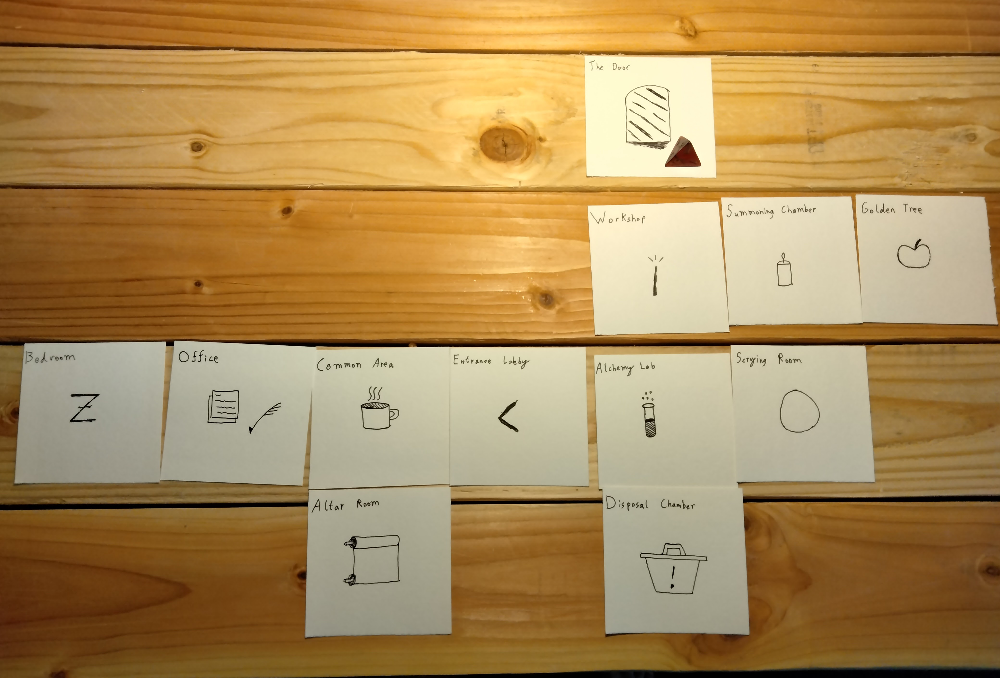

# Dungeons

#### Concept: The Room

Rooms are the atoms of a dungeon. They represents a single location with some form of challenge or interesting feature. When we refer to a "Dungeon", we are talking about a collection of Rooms that the Game Master places down in succession, connected by doors, tunnels, or secret passageways.

---

#### Room Templates

##### Hazard

> The most common type of room is the hazard, an environmental obstacle of some sort that the players must overcome. Simple examples include rivers that need to be crossed, cliffs that need to be climbed, or traps that need to be navigated. The distinguishing feature of a hazard is that **it can't be solved by reducing an enemy's hit points**. 

##### Threat

> In contrast to hazards, threats can be resolved by beating someone (or something) up. A pack of wolves, an ambush of goblins, and an undead necromancer are all threats. However, most threats can also be negotiated through diplomacy, bribery, or trickery should players demonstrate the necessary cunning.

##### Oddity

> These are rooms where nothing is overtly hostile or impeding the players. Instead, some feature of the room allows for optional interaction. A cursed sword stuck in the ground is in oddity, as is a demon trapped in a magic circle. The players can choose to ignore an oddity without issue, or take a risk (usually for the promise of extra treasure).

---

#### The Twelve Room Dungeon

A good rule of thumb is to prepare 12 rooms for every one session of play.

##### Why Twelve?

> It's easier to remove material on the fly than it is to improvise. With twelve rooms, you are unlikely to run out of content. Any unused rooms can be stashed away for a future session.

##### Other Tips

> * As players explore, use face-down cards to show rooms that they haven't been in yet. 
>
> * Use a d4 or similar to mark the party's current location.
>
> * Feel free to silently "cut out" rooms before the party gets to them if they're moving slower than expected.
> 
> * Feel free to change the ordering of the rooms as the players progress; only you know what rooms exist before they're put on the map.

